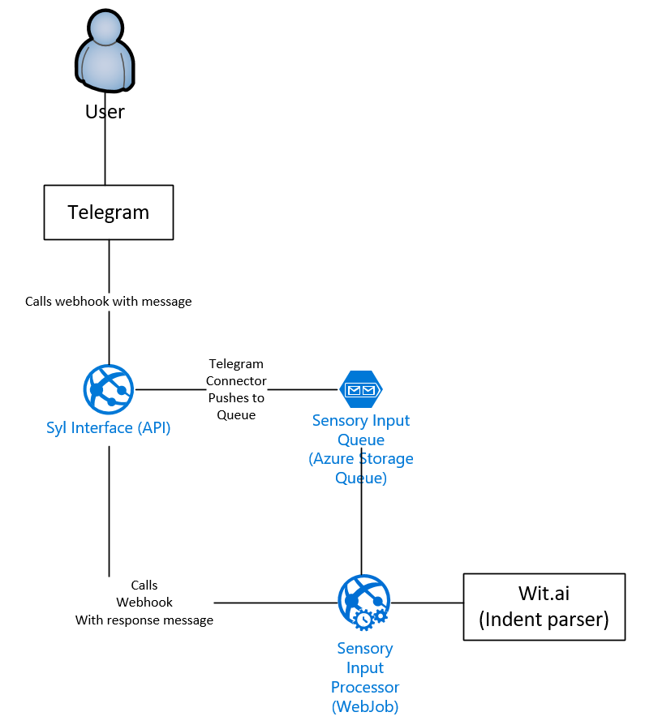

# Syl architecture

## Components
- Syl Interface 
  - Implemented as an Web API hosted on Azure.
  - Connects Syl to external services
  - Converts service specific inputs to common schema and writes to queue.
  - Converts common schema to output and responds to the corresponding service.
- Sensory Input Queue
  - Implemented as an Azure Storage Queue.
  - All the external inputs are stored here.
- Sensory Input Processor
  - Implemented as an Azure WebJob
  - A webjob that processes the sensory input and acts on it.
  - Calls wit.ai and identifies context and indents from the message.
  
 ## Architecture Diagram
  
